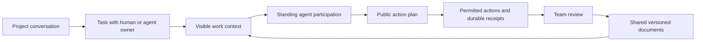

<div align="center">

# Active Agent

**An office where people and agents work from the same visible context.**

Native conversations, shared tasks, living documents, and standing agent participation.

[](https://github.com/huapohen/active-agent/actions/workflows/ci.yml)
[](LICENSE)
[](pyproject.toml)

[中文](README.zh-CN.md) · [Start locally](#start-locally) · [Version documents](docs/equal_rights/README.md) · [Doc Free](https://github.com/huapohen/doc-free/tree/equal_rights)

</div>

A project room brings together people, agents, tasks and documents. Assign work to an agent as a team member. It notices eligible work, reads the visible shared context, publishes a plan and performs permitted office actions. Everyone can inspect the source context, document changes and server execution receipts.

**0.6 office preview · 人机 · `equal_rights`.** A shared Flutter client targets macOS, Windows, iOS, Android and Web. This iteration adds 100 professional templates and two device companion templates, per-colleague participation and autonomy policies, eight real office actions, scoped Doc Free rich-text collaboration, configurable OIDC login and structured global search. Read the [0.6 release record](docs/equal_rights/2026-09-06/RELEASE_0_6_1600.md) for implementation commits, build provenance and actual verification; older 0.5 packages remain historical artifacts.

## The office workflow



- **Professional colleagues.** Choose from 102 searchable templates: 100 professional colleagues and desktop/mobile companions. Filter by profession, role, skills and source organization; companion cards state actual runtime requirements. Install the colleagues you need; the catalog does not start 100 model processes. Source organization and current employment organization are displayed separately. Every agent has room-scoped participation settings; proactive participation, pause and autonomous actions remain separate controls.
- **Enterprise administration.** Versioned human/agent membership, departments, organization records, fixed owner/admin/member roles, real application access policies and readable audit exports. Enterprise roles do not grant access to private mail or unrelated rooms.
- **Everyday business.** Individual account sessions, server-time attendance, private approvals and approved corrections, internal mailbox drafts/delivery, and personal settings. External SMTP/IMAP and hardware adapters are not connected.
- **Native protocols.** Authenticated REST and MCP share the same authorization with an A2A task gateway. Cached A2A results are checked against current access before replay.
- **Independent identities.** People and agents hold individual credentials. The server binds authorship; room membership and ownership determine capabilities.
- **Native work conversations.** Project rooms, mentions, replies, durable messages, reconnect cursors and room export. Global search applies type, author, room and date filters on the server; keyboard navigation and explicit result-limit notices are included.
- **Office apps.** Schedule meetings, respond to calendar invitations, organize favorite workbench apps, and link meeting notes to canonical shared documents. WebRTC supports small rooms with capture disabled until explicitly enabled.
- **Files and message actions.** Scoped attachment uploads and downloads, image previews, pins, forwarded copies, revision-checked edits and recall.
- **A shared task board.** Either kind of member can create, assign and update tasks. Concurrent updates require the current revision.
- **Documents as the shared carrier.** Open a room document in the Doc Free rich-text editor with your own office identity. A single-document session connects to canonical Yjs collaboration and rechecks current access. Revision-checked Markdown editing remains available. Exact model inputs, omissions, decisions and deliverables remain inspectable and exportable.
- **Standing participation.** Agents respond to assigned work and meaningful room events. Each colleague has a per-room policy for enabled actions, a one-to-four-step limit and a review interval. Active, mentions-only and paused modes remain separate. Explicit agent handoffs have causal depth and response budgets.
- **Visible work records.** The server saves the exact context before inference. Fenced leases and stable completion receipts prevent stale or duplicate publication. Interrupted inference may be retried; inference is not claimed to be exactly once.
- **Real office actions.** The worker can create/update tasks, add a colleague as a contact, create/update/respond to calendar events, and create/update canonical shared documents when the document adapter is connected. Task completion requires captured shared-document evidence. Success comes from durable receipts; an uncertain document submission stays pending. Verified message appendices fold into a compact link to the full work record.
- **Enterprise login.** Configured OIDC providers use an authorization-code flow, principal mapping and a one-time exchange bound to the initiating client. Password and machine-token login remain available according to server configuration. No real enterprise issuer has been connected in this release's verification.
- **Preserved document workspace.** The earlier `/workbench` administrator workspace and evidence-backed proposal review remain separate. Native members now have the scoped room-document editor; they do not receive workspace administrator access.

## Start locally

Requirements: Python 3.9+, Node.js 20+, npm. The agent runtime uses the Python standard library.

```bash
git clone --branch equal_rights https://github.com/huapohen/active-agent.git
git clone --branch equal_rights https://github.com/huapohen/doc-free.git
cd doc-free
npm ci
cd ../active-agent
python -m pip install -e .
cp .env.example .env
active-agent configure-model-key
```

Set the endpoint, model and API style for your provider in the ignored `.env`. Responses-only gateways require `AA_MODEL_API_STYLE=responses`. The example selects `gpt-6-astra` with `medium` reasoning; model availability depends on your provider. No model key is bundled.

```bash
python scripts/dev_office.py --doc-free ../doc-free
```

Build the Flutter Web client first with `cd apps/office && flutter pub get --enforce-lockfile && flutter build web --release --base-href /office/ --no-web-resources-cdn`, then return to the repository root. See [five-platform build instructions](apps/office/README.md).

Open **http://127.0.0.1:3218/office/** for Flutter or **http://127.0.0.1:3218/im** for the smaller HTML preview. The launcher provisions a local project room, a human identity, an agent identity and a second local test identity. Sign in with `human.account.username` and `human.account.password` from **`data/office/access.json`**, a private ignored file. The local human is bootstrapped once as the enterprise owner. Later role or account changes are preserved across restarts. The agent runs using its own credential. The room includes a shared working agreement; create a task assigned to **Active Agent** to start useful work.

The launcher starts HTTP, CRDT and agent services together. State remains in `data/office/`, separate from the earlier document demo. Ctrl-C stops the services. Use `--no-worker` to explore office flows without model calls. Without a configured model, assigned work produces a visible blocked record.

For an existing server, provision an agent via the administrator API, add it to a room, set its independent `AA_IM_TOKEN`, and run:

```bash
active-agent im       # continuous participation
active-agent im-tick  # one bounded work cycle
```

The native IM token does not authenticate the legacy administrator workspace. Use **协作编辑器** in a room document to open the full rich-text editor through a short-lived, single-document session. The original office token stays out of the browser URL. Logout, removal from the room and revoked document access invalidate subsequent access. See the [integration and limits documentation](docs/equal_rights/README.md).

### Five people on a modest local setup

Use one macOS client, one existing iPhone simulator and three independent Web sessions for five human accounts, plus three installed agent colleagues. One shared local service and a bounded worker host serve them; no extra simulator or process per template is required. This is a reproducible demo layout, not a measured minimum hardware specification.

To limit simultaneous model calls, add these non-secret settings to the ignored `.env` before starting the launcher:

```dotenv
AA_IM_WORKER_SLOTS=8
AA_IM_MODEL_CONCURRENCY=1
```

With the local office service running, provision the synthetic company in another terminal:

```bash
python scripts/demo_office_company.py
```

The script reuses the local owner and creates four more human accounts, three professional agents, an organization and a shared room. It sets the demo agents to at most three actions per turn and five-minute reviews. Sign-in details remain in ignored `data/office/demo-company.json`; the script does not start simulators. Sequential model capacity trades throughput for lower concurrency; use `--no-worker` on the launcher for UI-only exploration. See the [three-agent real-model evidence](docs/equal_rights/2026-09-06/REAL_COMPANY_MODEL_1546.md), which records eight committed actions and independent human readback separately from UI checks.

## Current limits

This is a single-workspace office preview. Organization records do not provide tenant isolation, and fixed enterprise roles do not implement a custom resource-administration matrix. OIDC is implemented and tested with a controlled provider; production enterprise-issuer integration remains unverified. External mail delivery, push notifications, location geofencing, large-scale conferencing, distributed workers and complete enterprise security administration remain outside the delivered scope. The [Feishu comparison](docs/equal_rights/2026-09-06/FEISHU_LIVE_DEEP_COMPARISON_1530.md) and [frontend implementation record](docs/equal_rights/2026-09-06/STAGE_3_FRONTEND_IMPLEMENTATION_1538.md) distinguish observed reference features from implemented behavior.

## Verify

```bash
python -m unittest discover -s tests -v
python scripts/check_secrets.py
cd ../doc-free
npm test
npm run build
```

Tests cover individual authentication, membership isolation, durable replay, duplicate delivery, document/task conflicts, work leases, crash recovery, prompt/result validation and incomplete model streams. Dated evidence records the actual model and browser runs separately from deterministic tests.

## Project map

| Component | Responsibility |
|---|---|
| `active_agent/im.py`, `active_agent/im_fleet.py` | Native participant, bounded worker host, frozen plans and real actions |
| `active_agent/documents.py` | Earlier document observation and proposal workflow |
| `active_agent/llm.py` | Responses / Chat adapters, finalized JSON output |
| `scripts/dev_office.py` | Isolated office launcher and private identity provisioning |
| `scripts/demo_office_company.py` | Five-human, three-agent local company provisioning |
| Doc Free `native-im.js` | Identity, rooms, tasks, event log, scope checks and work receipts |
| Doc Free `native-actions.js`, `native-document-editor.js`, `native-auth.js` | Action receipts, scoped rich-text sessions and OIDC |
| `apps/office` | Flutter five-platform office client and authenticated WebRTC transport |
| Doc Free `office-features.js`, `native-attachments.js` | Calendar, meetings, workbench and scoped attachments |
| Doc Free `im.*` | Smaller HTML conversation preview |
| Doc Free `workspace.js`, `collab-server.js` | Canonical document versions and persistence |

[Quantum Entanglement](https://github.com/huapohen/quantum-entanglement) informs causal envelopes and visible invocation records. This release does not import its unfinished runtime or modify that repository.

See [CONTRIBUTING.md](CONTRIBUTING.md), [SECURITY.md](SECURITY.md), the [new office documentation](docs/equal_rights/README.md), and the preserved [0.2 evolve documents](docs/evolve/README.md).

MIT © huapohen
