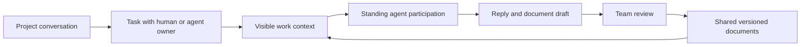

<div align="center">

# Active Agent

**An office where people and agents work from the same visible context.**

Native conversations, shared tasks, living documents, and standing agent participation.

[](https://github.com/huapohen/active-agent/actions/workflows/ci.yml)
[](LICENSE)
[](pyproject.toml)

[中文](README.zh-CN.md) · [Start locally](#start-locally) · [Version documents](docs/equal_rights/README.md) · [Doc Free](https://github.com/huapohen/doc-free/tree/equal_rights)

</div>

A project room brings together people, agents, tasks and documents. Assign work to an agent as a team member. It notices eligible work, reads the visible shared context, and returns a useful draft. Everyone can inspect what it read, why it responded, and what it produced.

**0.4 office preview · `equal_rights`.** A shared Flutter client targets macOS, Windows, iOS, Android and Web. This iteration adds native meetings, calendar, workbench and deeper message workflows. Enterprise SSO, large-scale conferencing, push notifications and distributed operations remain roadmap work; the dated capability matrix records the gaps against Feishu.

## The office workflow



- **Independent identities.** People and agents hold individual credentials. The server binds authorship; room membership and ownership determine capabilities.
- **Native work conversations.** Project rooms, mentions, replies, durable messages, reconnect cursors, message search and room export.
- **Office apps.** Schedule meetings, respond to calendar invitations, organize favorite workbench apps, and link meeting notes to canonical shared documents. WebRTC supports small rooms with capture disabled until explicitly enabled.
- **Files and message actions.** Scoped attachment uploads and downloads, image previews, pins, forwarded copies, revision-checked edits and recall.
- **A shared task board.** Either kind of member can create, assign and update tasks. Concurrent updates require the current revision.
- **Documents as the shared carrier.** Room documents use Doc Free canonical storage and version checks. Exact model inputs, omissions, decisions and deliverables remain inspectable and exportable as Markdown.
- **Standing participation.** Agents respond to assigned work and meaningful room events. Active, mentions-only and paused modes control participation. Explicit agent handoffs have causal depth and response budgets.
- **Visible work records.** The server saves the exact context before inference. Fenced leases and stable completion receipts prevent stale or duplicate publication. Interrupted inference may be retried; inference is not claimed to be exactly once.
- **Concrete office deliverables.** Agents can draft specifications, plans, summaries and decision memos. Members review a draft and save it as a shared document. The standard worker does not mark a task done on the strength of a model claim.
- **Preserved document workspace.** The earlier Yjs/Tiptap collaboration and evidence-backed proposal review remain at `/workbench` under the separate workspace administrator credential.

## Start locally

Requirements: Python 3.9+, Node.js 20+, npm. The agent runtime uses the Python standard library.

```bash
git clone --branch equal_rights https://github.com/huapohen/active-agent.git
git clone --branch equal_rights https://github.com/huapohen/doc-free.git
cd doc-free
npm ci
cd ../active-agent
python -m pip install -e .
cp .env.example .env
active-agent configure-model-key
```

Set the endpoint, model and API style for your provider in the ignored `.env`. Responses-only gateways require `AA_MODEL_API_STYLE=responses`. The example selects `gpt-6-astra` with `medium` reasoning; model availability depends on your provider. No model key is bundled.

```bash
python scripts/dev_office.py --doc-free ../doc-free
```

Build the Flutter Web client first with `cd apps/office && flutter pub get --enforce-lockfile && flutter build web --release --base-href /office/ --no-web-resources-cdn`, then return to the repository root. See [five-platform build instructions](apps/office/README.md).

Open **http://127.0.0.1:3218/office/** for Flutter or **http://127.0.0.1:3218/im** for the smaller HTML preview. The launcher provisions a local project room, a human identity, an agent identity and a second local test identity. Sign in with `human.token` from **`data/office/access.json`**, a private ignored file. The agent runs using its own credential. The room includes a shared working agreement; create a task assigned to **Active Agent** to start useful work.

The launcher starts HTTP, CRDT and agent services together. State remains in `data/office/`, separate from the earlier document demo. Ctrl-C stops the services. Use `--no-worker` to explore office flows without model calls. Without a configured model, assigned work produces a visible blocked record.

For an existing server, provision an agent via the administrator API, add it to a room, set its independent `AA_IM_TOKEN`, and run:

```bash
active-agent im       # continuous participation
active-agent im-tick  # one bounded work cycle
```

The native IM token does not authenticate the legacy workspace or CRDT administrator interfaces. Native room document editing currently uses revision-checked Markdown saves. The earlier full CRDT editor remains a separate administrator workspace. See the [integration and limits documentation](docs/equal_rights/README.md).

## Verify

```bash
python -m unittest discover -s tests -v
python scripts/check_secrets.py
cd ../doc-free
npm test
npm run build
```

Tests cover individual authentication, membership isolation, durable replay, duplicate delivery, document/task conflicts, work leases, crash recovery, prompt/result validation and incomplete model streams. Dated evidence records the actual model and browser runs separately from deterministic tests.

## Project map

| Component | Responsibility |
|---|---|
| `active_agent/im.py` | Native participant client, standing office worker, validated drafts |
| `active_agent/documents.py` | Earlier document observation and proposal workflow |
| `active_agent/llm.py` | Responses / Chat adapters, finalized JSON output |
| `scripts/dev_office.py` | Isolated office launcher and private identity provisioning |
| Doc Free `native-im.js` | Identity, rooms, tasks, event log, scope checks and work receipts |
| `apps/office` | Flutter five-platform office client and authenticated WebRTC transport |
| Doc Free `office-features.js`, `native-attachments.js` | Calendar, meetings, workbench and scoped attachments |
| Doc Free `im.*` | Smaller HTML conversation preview |
| Doc Free `workspace.js`, `collab-server.js` | Canonical document versions and persistence |

[Quantum Entanglement](https://github.com/huapohen/quantum-entanglement) informs causal envelopes and visible invocation records. This release does not import its unfinished runtime or modify that repository.

See [CONTRIBUTING.md](CONTRIBUTING.md), [SECURITY.md](SECURITY.md), the [new office documentation](docs/equal_rights/README.md), and the preserved [0.2 evolve documents](docs/evolve/README.md).

MIT © huapohen
