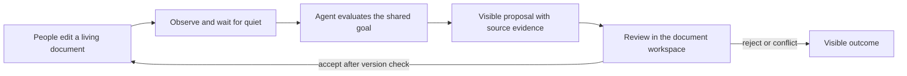

<div align="center">

# Active Agent

**Give your agent a document to live in.**

Proactive agents that work alongside people in visible, collaborative documents.

[](https://github.com/huapohen/active-agent/actions/workflows/ci.yml)
[](LICENSE)
[](pyproject.toml)

[中文介绍](README.zh-CN.md) · [Start locally](#start-locally) · [Architecture](docs/evolve/2026-09-06/02-architecture.md) · [Roadmap](docs/evolve/2026-09-06/05-roadmap.md) · [Doc Free](https://github.com/huapohen/doc-free/tree/evolve)

</div>


A person writes a goal. An agent notices meaningful document changes, waits until editing settles, and brings back a concrete proposal. Everyone sees the same source, evidence, proposed change and outcome.

The shared document is the collaboration surface. Goals and decisions remain readable and exportable after the worker restarts—or its local checkpoint database disappears.

## The loop



- **Proactive by default.** The worker observes continuously. No repeated prompts or manual refresh to start another round.
- **Document-native context.** Source documents, mission contracts, proposals and observations are ordinary Doc Free documents.
- **Real collaboration.** [Doc Free](https://github.com/huapohen/doc-free) supplies Tiptap + Yjs + Hocuspocus. People edit the same live document the agent reads.
- **Reviewable changes.** Exact source quotes, before/after text, actor, revision and resolution are visible before acceptance.
- **Respect concurrent work.** Source or mission changes invalidate stale results. Acceptance compares the live CRDT state inside its write transaction.
- **Recoverable work.** Deterministic run identities suppress duplicate publications. A CRDT commit receipt recovers interrupted acceptance.
- **Bring your model.** Responses streaming and Chat Completions adapters; configurable model and reasoning effort. No model key is bundled.
- **Open interfaces.** REST and seven `active_doc_*` MCP tools use the same document workflow.

**Status: 0.2 evolution preview.** This is a working, tested local collaboration loop. It is not yet a multi-tenant service, a complete rich-document platform or a distributed agent fleet. See the [precise boundaries](docs/evolve/2026-09-06/04-validation-and-limits.md). IM is outside this release.

## Start locally

Requirements: Python 3.9+, Node.js 20+ and npm. The document worker uses the Python standard library.

```bash
git clone --branch evolve https://github.com/huapohen/active-agent.git
git clone --branch evolve https://github.com/huapohen/doc-free.git
cd doc-free
npm ci
cd ../active-agent
python -m pip install -e .
cp .env.example .env
active-agent configure-model-key
```

Set your provider's endpoint, model and API style in the ignored `.env`. The credential prompt keeps the model key out of shell history. Use `AA_MODEL_API_STYLE=responses` for Responses-only providers; the default reasoning effort in the example is `medium`. Supported models depend on your provider.

```bash
python scripts/dev_workspace.py --doc-free ../doc-free
```

Open **http://127.0.0.1:3217/workbench**. Enter a display name and `AA_DOC_FREE_TOKEN` from your local `.env`; the launcher creates that workspace token if needed. Click **体验一次协作** to create an example source and a standing goal. Wait for a proposal, review its evidence, and accept or reject it.

The launcher starts Doc Free, the CRDT service and the document worker together. Development data stays under `active-agent/data/workspace/`, separate from any existing Doc Free data. Ctrl-C stops these processes. Nothing is deployed by this command.

Without a model key, the system creates a visible blocked observation instead of fabricating an AI result. Configure a model and restart to continue. The [Chinese walkthrough](docs/evolve/2026-09-06/03-quickstart-and-protocol.md) covers manual startup, MCP and conflict handling.

## Verify

```bash
python -m unittest discover -s tests -v
python scripts/check_secrets.py
cd ../doc-free
npm test
npm run build
```

The Doc Free tests launch real isolated HTTP and CRDT servers. They check duplicate delivery, version conflicts, acceptance/rejection, direct CRDT changes, event replay, process restart and interrupted commit recovery. Python tests exercise debounce, leases, retry limits, lost-checkpoint recovery, evidence validation and incomplete model streams.

## Project map

| Component | Responsibility |
|---|---|
| `active_agent/documents.py` | Observation, quiet windows, model evaluation and recoverable scheduling |
| `active_agent/llm.py` | Responses / Chat adapters; finalized JSON only |
| `scripts/dev_workspace.py` | One-command isolated local workspace |
| Doc Free `workspace.js` | Visible mission contracts, proposals and review protocol |
| Doc Free `collab-server.js` | Canonical CRDT reads, compare-and-replace, commit receipts |
| Doc Free `workbench.*` | Document workspace and shared editing |

The original 0.1 event/mission APIs remain available for compatibility. The `evolve` implementation adds a document-native runtime; it does not build or integrate an IM.

## Build with us

The roadmap is organized around reproducible collaboration quality: fewer unnecessary interventions, reliable review, no lost edits, portable documents and a short time to first useful proposal. Stars are an outcome, not a substitute for those properties.

See [CONTRIBUTING.md](CONTRIBUTING.md), [SECURITY.md](SECURITY.md) and the [dated evolution documents](docs/evolve/README.md). All new capabilities should include an observable document-level result and a failure/recovery story.

MIT © huapohen
