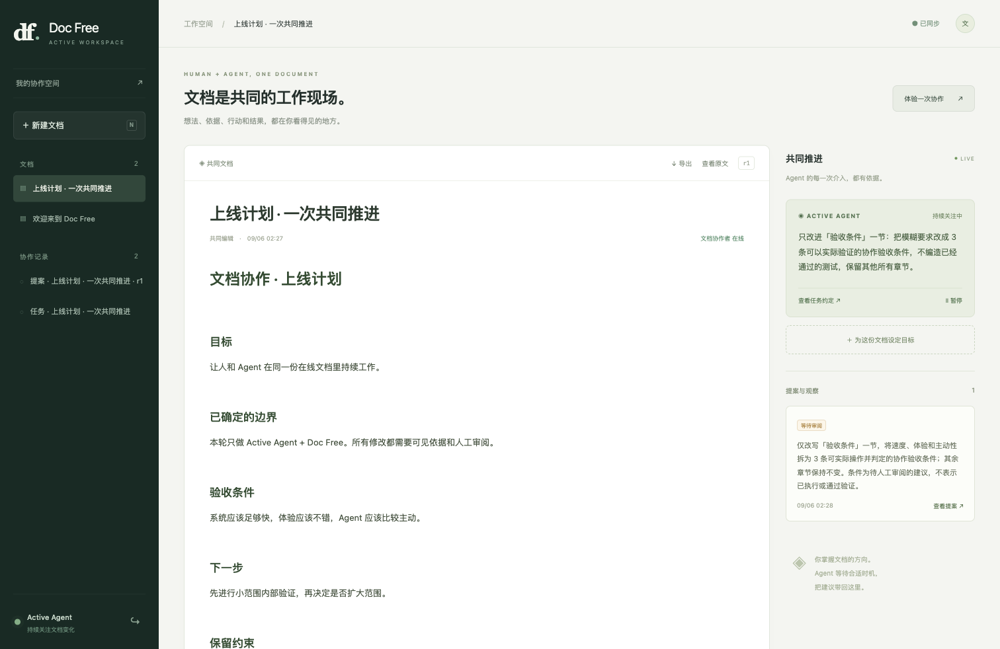

# Active Agent

**给 Agent 一份可以持续工作的文档。**

Active Agent 与 [Doc Free](https://github.com/huapohen/doc-free/tree/evolve) 共同构成人机在线协作文档工作空间：人写目标、继续编辑；Agent 自动观察变化、等待合适时机，把有依据的建议带回文档。



## 文档就是协作载体

任务约定、来源正文、判断依据、提案和处理结果都必须人眼可见、Agent 可读。数据库和内存承担保存与调度，不成为只有 Agent 知道的第二套工作现场。

本轮范围严格限定为 **Active Agent + Doc Free**。不接入 quantum-entanglement，不扩展 IM、群组或消息功能。

## 这一版已经能做什么

1. 人在真实的 Yjs 在线协作文档中编辑，其他浏览器和 Agent 都能读到变化。
2. 在工作台创建一个持续目标，它会生成一份普通任务文档。
3. 后台自动观察；连续修改重置安静窗口，正文安静后才请求模型。
4. Agent 提案包含原文引用、修改前后内容、来源版本和解释。
5. 人在同一工作台接受或拒绝；正文或任务变了，就保留现有正文并标记冲突。
6. 任务可暂停、继续，所有文档可导出 Markdown；进程重启后可恢复。

本轮提供 `Responses` 和 `Chat Completions` 两种协议。真实验证使用用户指定的 `gpt-6-astra / medium`；临时模型服务地址与凭据仅保存在本机 `.env`。

## 开始体验

完整安装命令见 [英文首页](README.md#start-locally)。两个仓库均切到 `evolve` 后，在 active-agent 中执行：

```bash
python scripts/dev_workspace.py --doc-free ../doc-free
```

本机目录名称为 `doc_free` 时，改为 `--doc-free ../doc_free`。浏览器打开 `http://127.0.0.1:3217/workbench`，输入显示名称与本机 `.env` 的 `AA_DOC_FREE_TOKEN`，点击“体验一次协作”。启动器会同时运行文档服务、CRDT 服务和主动 Agent。

## 文档与版本

[2026-09-06 演进文档](docs/evolve/README.md) 是新的文档序列，每篇标注对应实现 commit、时间和描述。原有 `docs/architecture.md`、`docs/technical-architecture.*` 保留为 0.1 历史资料。

当前是 **0.2 演进预览**。已经实现可运行的闭环，但还没有文档级身份权限、成熟的富文本往返、分布式调度与公开压力基准。走向大型开源项目的产品路线与验收指标见 [路线图](docs/evolve/2026-09-06/05-roadmap.md)。
