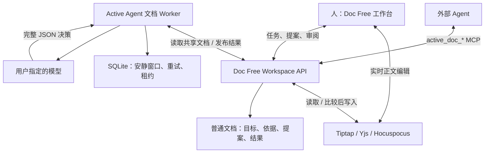

# Active Agent × Doc Free 技术架构

> 文档序列：`evolve / 2026-09-06 / v0.2`
>
> 编写时间：`2026-09-06T02:50:08+08:00`（Asia/Shanghai）
>
> Active Agent 实现：[`c05f904`](https://github.com/huapohen/active-agent/commit/c05f904f0ec11d680d5527e37519e1836ccba0af) · `2026-09-06T02:41:10+08:00` · feat: evolve proactive agents around visible collaborative documents
>
> Doc Free 实现：[`f5c3b6f`](https://github.com/huapohen/doc-free/commit/f5c3b6f0cdbf03b74895d6e3884154578b8ceb3f) · `2026-09-06T02:41:11+08:00` · feat: add document-native workspace for proactive agent collaboration
>
> Doc Free 源码排版：`b182142` · `2026-09-06T02:42:03+08:00`
>
> 旧版资料保留，新版结论以本序列的实现、验证和限制为准。

## 1. 组件边界

Active Agent 的 `documents.py` 是新增的文档运行时，与 0.1 的会话事件路径分离。Doc Free 的 `workspace.js` 负责业务协议，`work-protocol.js` 负责契约解析与校验，`workspace-mcp.js` 把相同动作暴露给外部 Agent。没有引入 IM 依赖。

## 2. 四类可见文档

| 文档 | 作用 | 语义所在位置 |
|---|---|---|
| 来源文档 | 人和 Agent 共同面对的工作内容 | 普通正文和标题 |
| 任务文档 `mission` | 目标、来源文档、状态、安静窗口 | 可读的 `active-agent` 契约块 |
| 提案文档 `proposal` | 来源、证据、前后文本、解释、审阅结果 | 契约块与人可读依据章节 |
| 观察文档 `run` | `stay_silent` / `blocked` 与理由 | 同上 |

契约块是普通 Markdown 文档的一部分，不在用户不可见的任务表中。工作台将其呈现为目标卡、提案审阅和状态，也允许查看完整原文。任务原文支持带基线版本的编辑；运行记录和提案在新工作台接口中通过专门动作更新。

这不是不可篡改的审计账本。旧版通用文档工具仍然存在；拥有整个工作空间令牌的可信客户端能够访问它们。

## 3. 当前主动运行机制

0.2 **采用后台自动轮询**：默认每 2 秒读取共享文档；浏览器约每 2.5 秒刷新任务与提案投影。正文协作本身通过 WebSocket 实时同步。变更日志已经提供可重放游标，但本轮 worker 尚未改成纯推送订阅。

- 每个任务与来源版本首次被观察时记录时间。
- 任务版本、来源版本或正文摘要变化，会重置安静窗口。
- 达到任务的 `quiet_seconds` 后才调用模型，范围为 2–3600 秒；工作台默认 8 秒，示例为 5 秒。
- 同一任务/来源/模型配置已有可见结果时，不重复调用。
- 接受提案产生的正文版本不会立即触发 Agent 再次改写自己的结果。
- 每轮最多评估 4 个任务；超过 60000 字符的来源生成可见阻塞记录。
- 模型或发布失败会退避重试；连续 3 次失败后生成阻塞记录，避免无限消耗。

模型未配置时明确写出阻塞状态，不用规则结果伪装成大模型产出。模型配置变化后可以重新评估原本由 `rules` 标记的阻塞记录。

## 4. 版本、并发与接受事务

每次读取包含文档 revision、正文 SHA-256、更新时间和可解析契约。Doc Free 同时记录整个 Yjs 状态编码的摘要，捕获“文字没变但格式/结构已变”的情况。

模型结果提交时必须引用它实际读取的任务版本、来源版本和正文摘要。服务端重新读取来源 CRDT；不匹配则返回 `409 stale_run`，丢弃这次结果。

接受提案时依次检查：

1. 提案是否仍在等待审阅，调用方是否提供对应提案版本。
2. 任务是否仍 active，任务版本是否与提案引用一致。
3. 来源文档版本与正文摘要是否仍一致。
4. 在 Hocuspocus 的同一个写事务内，再检查预期正文、标题、CRDT 状态摘要。

任何不一致都会保留当前正文。与真正冲突的提案标记为 `conflicted`；来源更新后 worker 会观察新的任务版本组合。

JSON 文档投影只在 CRDT 写入成功后更新。单个文档的服务端操作通过进程内队列串行化；这不是跨服务实例的分布式锁。

## 5. 中断恢复与幂等

发布结果的文档 ID 来自任务 ID、任务 revision、来源 ID/revision/hash、模型与 reasoning effort 的确定性摘要。同一输入版本的重试复用已发布记录，避免出现两个相同提案。

接受正文时，CRDT 的 `active-agent-operations` map 同时写入该提案的提交回执。若进程在正文写完、提案状态更新前停止，重试会从回执确认已经执行，完成状态收尾而不再次改写正文。

Yjs 文件和 JSON 投影使用临时文件后 rename 的方式提交，避免半截 JSON 或 Yjs 文件。测试覆盖进程重启和明确的中断窗口；未做断电、磁盘故障或跨机器故障测试，也不承诺数据库级跨文件事务。

SQLite 只保存任务版本检查点、重试时间和 worker 租约。丢失它后，worker 仍能从可见的任务/提案/观察文档恢复“哪些版本已经处理过”。多个本机 worker 需要共用同一个 checkpoint 文件才能共享租约；不同机器独立运行不在当前部署承诺内。

## 6. 模型适配

`llm.py` 支持两种显式协议：

- Chat Completions：`/chat/completions`，`reasoning_effort`。
- Responses：`/responses`，`reasoning.effort`，`store=false`，SSE 流。

真实网关返回过“该模型通道不支持 Chat Completions”，因此本机配置采用 Responses。模型名称保持 `gpt-6-astra`，默认思考强度保持 `medium`。

Responses 只在 `response.completed` 成功后接受最终 JSON。部分网关在 completed 中省略 output，此时使用此前完整的 `response.output_text.done`；不会把 delta 或中断输出写入文档。模型返回结构、置信度、引用和修改文本均有校验。

协议参考：[OpenAI Responses create](https://developers.openai.com/api/reference/resources/responses/methods/create)。第三方网关的模型可用性与具体行为以实测为准，官方协议说明不能替代第三方兼容性测试。

## 7. 当前工程边界

- 单进程 Doc Free、文件持久化、本机 worker；没有多租户隔离。
- 共享令牌和 actor 标签；没有 OIDC、文档 ACL 或严格的人/Agent 身份分离。
- Markdown 文本、段落和标题是本轮验证重点。复杂列表、标记、表格、附件、评论、白板的无损往返仍未完成。
- 目前提案携带整篇修改后的文本，审阅展示完整前后对照；没有局部接受和语义三方合并。
- 全量文档轮询、完整 CRDT 摘要和未压缩事件日志不适合无限增长。大规模部署前必须替换这些路径。
