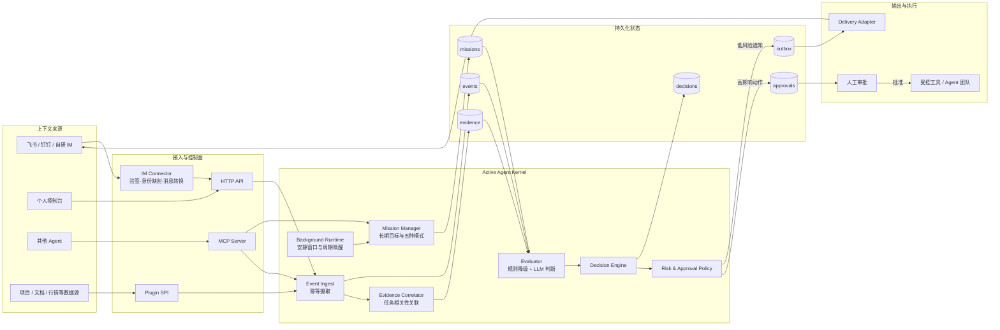
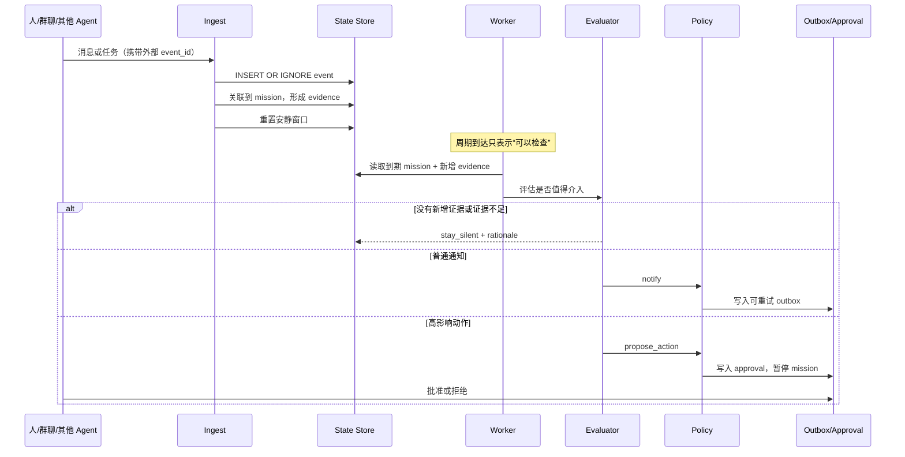
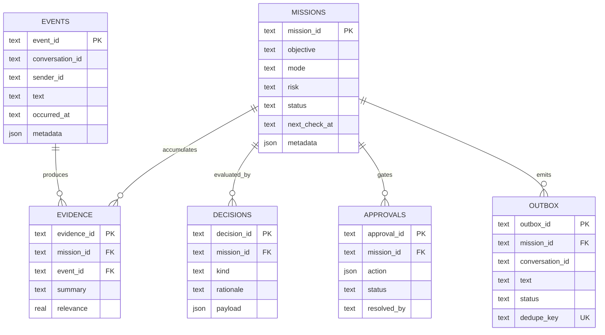
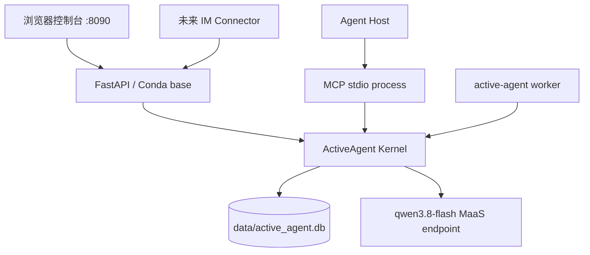
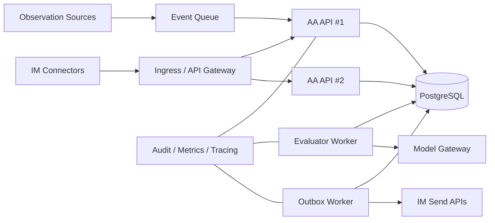

# Active Agent 技术架构

> 版本：0.1.0　状态：MVP 内核已实现　更新时间：2026-09-02

## 1. 架构目标

Active Agent（AA）不是一次请求、一次回答的聊天机器人，而是一个能够持续接收上下文、保存长期目标、积累证据、选择介入时机并恢复执行的主动式智能体运行时。

核心设计目标：

- **持续感知**：群聊、人类和其他 Agent 的消息统一进入事件流。
- **任务长期存活**：进程重启不会丢失目标、证据、决策和待发送消息。
- **审慎主动**：定时器只负责唤醒；是否发言由新增证据和策略决定。
- **人机协同**：高影响动作先进入审批，不因模型输出直接执行。
- **接口解耦**：IM 使用 HTTP 数据面，Agent 使用 MCP 控制面，领域能力使用插件扩展。
- **可审计**：能回答“为什么此时介入、根据什么证据、谁批准了动作”。

## 2. 总体架构



## 3. 接口分工

| 接口 | 面向对象 | 职责 | 当前状态 |
|---|---|---|---|
| HTTP API | IM、自研应用、Web 控制台 | 摄取事件、创建任务、查询状态、巡检、审批、outbox | 已实现 |
| MCP stdio | 其他 Agent / Agent Host | 分配长期任务、补充上下文、查询状态、触发巡检、审批 | 已实现 |
| Python Plugin SPI | 同进程领域扩展 | 丰富事件、观察决策、接入领域数据 | 已实现基础协议 |
| IM Connector | 飞书、钉钉、企业微信、自研 IM | 验签、身份映射、消息格式转换、原生发送 | 待按目标 IM 实现 |
| Delivery Adapter | outbox 消费者 | 发送消息、`@`成员、回写送达状态 | 已定义接口，待实现平台适配 |

HTTP 与 MCP 不互相替代：HTTP 是 IM 消息数据面，MCP 是 Agent-to-Agent 控制面，两者共用同一个 AA 内核和状态库。

## 4. 主动循环



主动性的关键约束：

1. `tick` 不是发言触发器，只是评估机会。
2. 没有新增任务证据时保持沉默。
3. 连续聊天会延后 `next_check_at`，先合并信息再介入。
4. 每个判断写入 `decisions`，主动消息先写入 `outbox`。
5. outbox 使用唯一 `dedupe_key`，发送失败可安全重试。

## 5. 五种运行模式

| 产品模式 | 内核值 | 典型输入 | 主要退出/通知条件 |
|---|---|---|---|
| Todo 管家 | `todo_steward` | “提炼事项并在合适时提醒相关人员” | 出现责任人、阻塞、承诺变化或可行动节点 |
| 长期留意 | `watch` | “帮我留意什么时候适合买入” | 新证据达到任务阈值；只建议，不自动交易 |
| 私人研究 | `private_research` | 连续投递资料并询问“是否够了” | 资料充分性达到阈值，可形成一套或多套方案 |
| Agent 副驾驶 | `agent_copilot` | 百小时任务中的关键线索托管 | 主 Agent 需要恢复上下文、发生偏航或关键矛盾 |
| 开放式统帅 | `orchestrator` | 模糊目标，由 AA 拆解并组织团队 | 先形成委派提案；审批后才允许真实调度 |

## 6. 数据模型



## 7. 模型与策略层

当前模型通过 OpenAI-compatible Chat Completions 接口调用 `qwen3.8-flash`。Evaluator 要求模型输出结构化 JSON：

```json
{
  "action": "stay_silent | notify | complete | propose_action",
  "rationale": "判断理由",
  "message": "准备发送的内容",
  "confidence": 0.0,
  "requires_approval": false,
  "proposed_action": null
}
```

防失控措施：

- 低置信度输出强制转为 `stay_silent`。
- 模型请求失败时降级为保守规则策略。
- 模型只提供决策建议，权限由 Policy 和审批状态控制。
- 股票、投资、付款、删除、企业资源变更和 Agent 委派不得因模型文本直接执行。
- API Key 仅存本机 Git 忽略的 `.env`，运行与排查不得输出完整值。

## 8. 当前部署拓扑



当前本机进程：

- `python -m uvicorn active_agent.api:app --host 127.0.0.1 --port 8090`
- `active-agent worker`
- Python 运行环境：Conda `base`

## 9. 生产架构演进



生产化建议顺序：

1. 实现目标 IM Connector，包括验签、租户隔离、原生 mention 和发送回执。
2. SQLite 迁移 PostgreSQL，使用数据库租约保证同一 mission 单 worker 执行。
3. evaluator worker 与 outbox worker 分离，增加退避重试和死信处理。
4. 增加任务级摘要、全文/向量混合检索和证据引用，支撑百小时上下文。
5. 建立 Agent Registry、能力声明、预算、沙箱、信任等级和审批策略。
6. 增加 OpenTelemetry、成本计量、审计检索和租户级保留策略。

## 10. 代码映射

| 架构模块 | 当前实现 |
|---|---|
| 领域模型 | `active_agent/models.py` |
| 状态存储 | `active_agent/store.py` |
| 主动循环 | `active_agent/engine.py` |
| 评估策略 | `active_agent/policy.py` |
| 模型适配 | `active_agent/llm.py` |
| HTTP API / 控制台 | `active_agent/api.py`、`active_agent/web/index.html` |
| MCP Server | `active_agent/mcp_server.py` |
| 后台运行时 | `active_agent/runtime.py` |
| 插件协议 | `active_agent/plugins.py` |
| IM 发送协议 | `active_agent/adapters/base.py` |

## 11. 当前边界

当前版本已经能够作为 AA 内核运行和被 IM 接入，但以下能力尚未宣称完成：

- 尚未实现某个具体 IM 的生产 Connector。
- SQLite 适合单机 MVP，不适合多副本并发生产部署。
- 尚未实现面向海量上下文的向量检索与摘要压缩。
- Orchestrator 当前停在“形成并审批委派提案”，没有开放无限制自主执行。
- Web 控制台是运维入口，不是完整企业权限管理后台。

